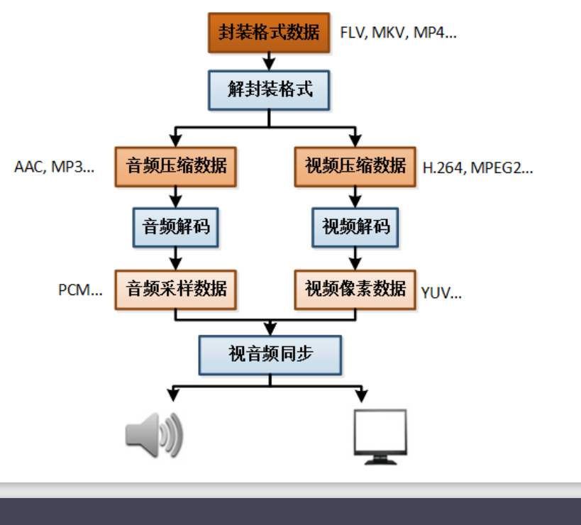

## 音视频的采集
 音视频的采集包括摄像头的采集，麦克风，扬声器，本地视频，游戏图像，显示器桌面的采集
## 预处理
 频数据的预处理一般包括视频图像的滤镜处理、美颜处理、加字幕，绿幕抠图
 1. AGC：自动增益补偿功能（Automatic Gain Control）
 2. ANS：背景噪音抑制功能（Automatic Noise Suppression）
 3. AEC：回声消除器（Acoustic Echo Canceller）
## 编码
 H264/H265/VP8/VP9/AV1  
 AAC/Opus/mp3
## 封装
 音视频编码后需要将音视频包以某种容器封装起来，这个步骤成为音视频的封装。常见的封装格式
 flv/mp4/ts/rtp  
 `ffmpeg -muxers`
## 传输
 常见的音视频的网络传输协议有 rtmp http-flv rtsp srt hls rtc udp
## 解封装
 解封装是上面介绍的封装的逆操作，从音视频的容器中将音频包、视频包分离出来放到各自的队列
## 解码
 编码的逆操作，将视频包解码成原始的视频帧，将音频包解码成原始的pcm音频数据
## 渲染
 视频的渲染 windows 平台下可以使用 Direct3D 技术渲染视频，macOS，Android 和 Linux 可以使用 OpenGL 、OpenGLES 技术渲染视频
