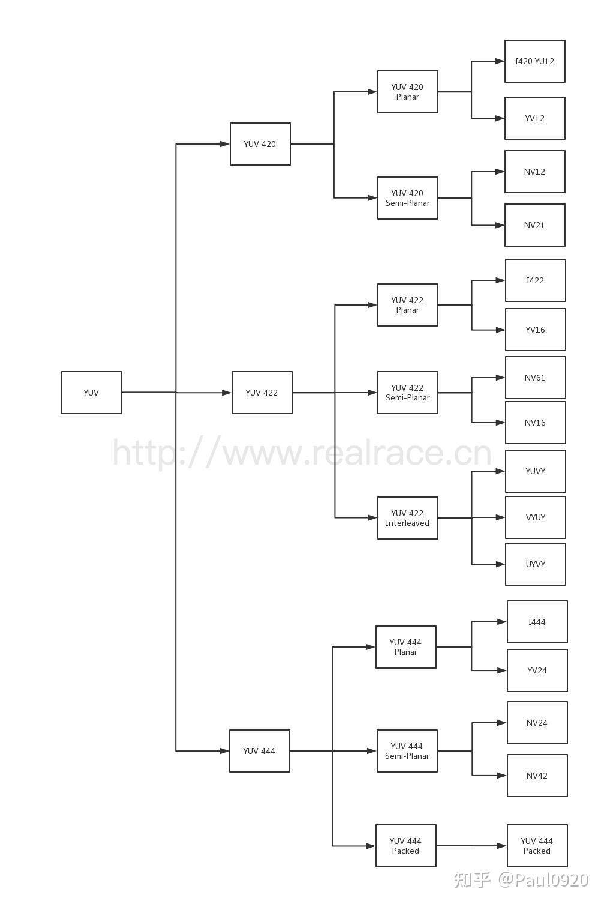
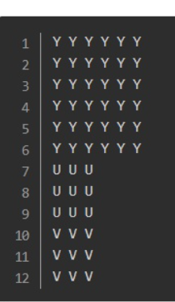
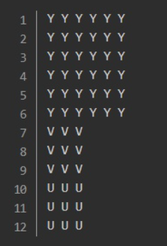
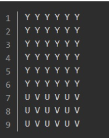
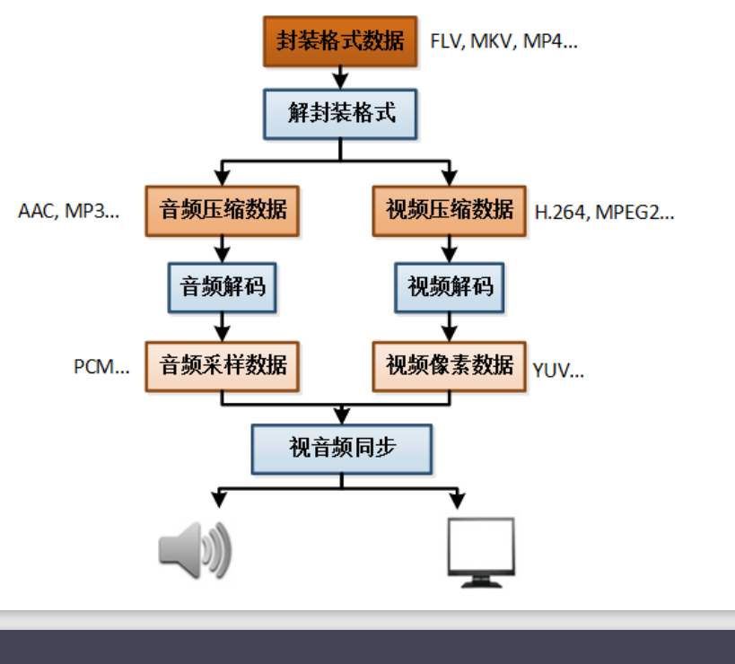
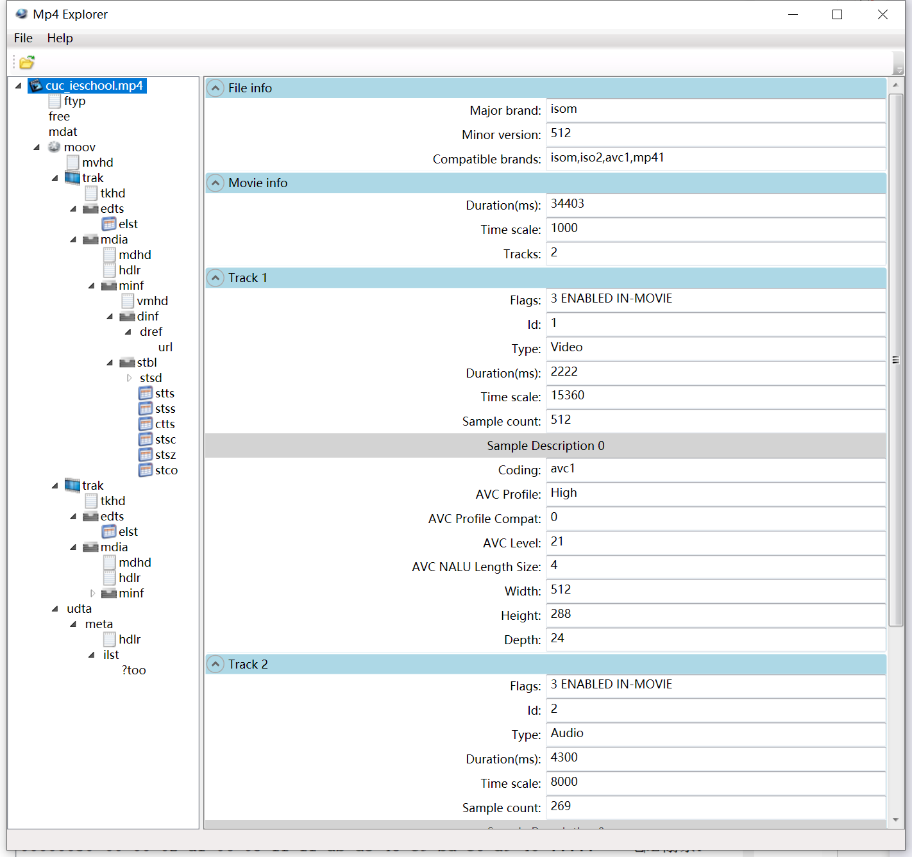
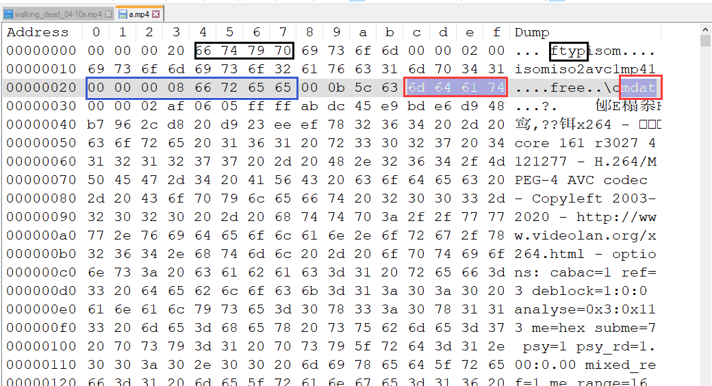
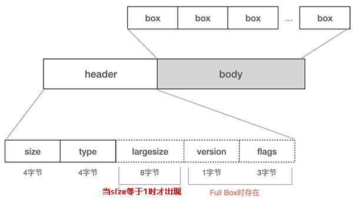
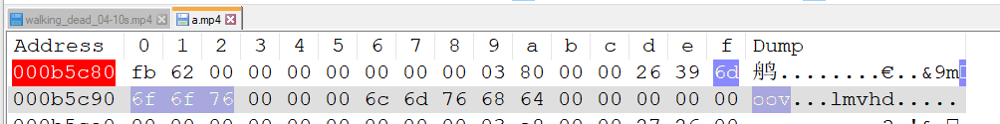

# 音视频编解码
<!-- TOC -->

- [音视频编解码](#%E9%9F%B3%E8%A7%86%E9%A2%91%E7%BC%96%E8%A7%A3%E7%A0%81)
    - [音视频基础知识](#%E9%9F%B3%E8%A7%86%E9%A2%91%E5%9F%BA%E7%A1%80%E7%9F%A5%E8%AF%86)
        - [像素格式之YUV与RGB](#%E5%83%8F%E7%B4%A0%E6%A0%BC%E5%BC%8F%E4%B9%8Byuv%E4%B8%8Ergb)
            - [YUV格式分析](#yuv%E6%A0%BC%E5%BC%8F%E5%88%86%E6%9E%90)
    - [视频播放器原理](#%E8%A7%86%E9%A2%91%E6%92%AD%E6%94%BE%E5%99%A8%E5%8E%9F%E7%90%86)
    - [封装格式（MP4，RMVB，TS，FLV，AVI）](#%E5%B0%81%E8%A3%85%E6%A0%BC%E5%BC%8Fmp4rmvbtsflvavi)
        - [MP4](#mp4)
            - [使用Mp4Explorer 查看数据结构](#%E4%BD%BF%E7%94%A8mp4explorer-%E6%9F%A5%E7%9C%8B%E6%95%B0%E6%8D%AE%E7%BB%93%E6%9E%84)
            - [查看二进制文件](#%E6%9F%A5%E7%9C%8B%E4%BA%8C%E8%BF%9B%E5%88%B6%E6%96%87%E4%BB%B6)
            - [对应box简要说明](#%E5%AF%B9%E5%BA%94box%E7%AE%80%E8%A6%81%E8%AF%B4%E6%98%8E)
        - [MPEG-TS封装格式](#mpeg-ts%E5%B0%81%E8%A3%85%E6%A0%BC%E5%BC%8F)
    - [视频编码数据（H.264，MPEG2，VC-1）](#%E8%A7%86%E9%A2%91%E7%BC%96%E7%A0%81%E6%95%B0%E6%8D%AEh264mpeg2vc-1)
    - [音频编码数据（AAC，MP3，AC-3）](#%E9%9F%B3%E9%A2%91%E7%BC%96%E7%A0%81%E6%95%B0%E6%8D%AEaacmp3ac-3)
    - [视频像素数据（YUV420P，RGB）](#%E8%A7%86%E9%A2%91%E5%83%8F%E7%B4%A0%E6%95%B0%E6%8D%AEyuv420prgb)
    - [音频采样数据（PCM）](#%E9%9F%B3%E9%A2%91%E9%87%87%E6%A0%B7%E6%95%B0%E6%8D%AEpcm)

<!-- /TOC -->
## 音视频基础知识
### 像素格式之YUV与RGB
#### YUV格式分析
YUV 格式是一种比较通用的图像格式，其来源于电视系统，YUV 的全称是 YUV420P，其中 Y 表示明亮度 Luminance，U 表示色度 Chrominance，V 表示浓度 Chrominance。

**YUV420格式**  
*YUV420 Plannar*
* I420（属于 YUV 420 Plannar）
I420 是 YUV 420 Planar 的一种，YUV 分量分别存放，先是 w * h 长度的 Y，后面跟 w * h * 0.25 长度的 U， 最后是 w * h * 0.25 长度的 V，总长度为 w * h * 1.5。

* YV12（属于 YUV 420 Plannar）
YV12 是 YUV 420 Planar 的一种，YUV 分量分别存放，先是 w * h 长度的 Y，后面跟 w * h * 0.25 长度的 V， 最后是 w * h * 0.25 长度的 U，总长度为 w * h * 1.5。与 I420 不同的是，YV12 是先 V 后 U
  

*YUV420SemiPlanar*
每四个Y共享一对uv值，其中分NV21和NV12格式，前者V在前后者U在前。数据总长度为w*h*1.5
* NV12（属于 YUV 420 Semi-Planar）

* NV21（属于 YUV 420 Semi-Planar）

* I422（属于 YUV 422 Plannar）
I422 是 YUV 422 Planar 的一种，YUV 分量分别存放，先是 w * h 长度的 Y，后面跟 w * h * 0.5 长度的 U， 最后是 w * h * 0.5 长度的 V，总长度为 w * h * 2。
   

其他的暂时不做讲解可以[参考](https://zhuanlan.zhihu.com/p/384455058)
#### RGB格式分析
RGB 格式是一种比较通用的图像格式，其来源于电视系统，RGB 的全称是 RGB444，其中 R 表示红色，G 表示绿色，B 表示蓝色。
## 视频播放器原理
 播放器播放流程：
    
## 封装与解封装（MP4，RMVB，TS，FLV，AVI）
**封装**：也称为容器格式（container format），是指将视频编码、音频编码、字幕等多种媒体数据以及相关的元数据组合在一起，形成一个统一的文件格式。封装格式可以看作是一个“盒子”，将视频、音频等不同的数据流打包在一起，同时提供索引信息、时间戳、元数据等辅助信息。
**视频的封装具有以下几个作用：**
* 整合多个媒体流：将视频、音频、字幕等多个媒体数据整合到一个文件中，方便管理和传输。
* 提供索引和时间戳：封装格式通常包含索引表和时间戳等信息，可以快速定位和访问特定的时间点或帧。
* 支持元数据：封装格式可以存储与视频相关的元数据，如标题、作者、描述等。
* 支持压缩：封装格式可以对媒体数据进行压缩，减小文件大小。
**解封装**：也称为分离或者解复用（demultiplexing），是指将封装格式中的各个媒体流解析出来，分离成独立的视频、音频等数据流。解封装过程是根据封装格式中的信息，将媒体数据还原为原始的压缩编码格式，并提供给相应的解码器进行解码和播放。
解封装主要分离多个媒体流，和提取元素据信息包括帧率分辨率音频采样等
 ### MP4
 #### 使用Mp4Explorer 查看数据结构
 MP4 格式 是一个 box 的格式，box 容器 套 box 子容器，box 子容器 再套 box 子容器。看起来跟 json 很像。   

#### 查看二进制文件
 二进制信息
 解析一个 MP4 文件是这样的，刚开始的 0 ~ 3 字节是 box 的 size （大小），然后 4 ~ 7 字节是 box 的类型。从上图可以看出，第一个 box 的大小 是 0x20 字节（包含头部），然后这个是 ftyp 类型的box，至于这 0x20 字节里面是什么内容 就按照 ftyp 类型去解析就行    
 
 * 黑色圈出来的 box 是 ftyp，全称 File Type Box。ftyp 前面的 4个字节是 0x20（16进制）。也就说，这个 ftyp box 是 32 字节的长度，32字节是包含 size 的4个字节的。ftyp 是一级 box，里面没有子box了。
* 蓝圈圈出来的 box 是 free，只有 8个字节大小，size 占 4个字节，type 占4个字节。
* 红色圈出来的 box 是 mdata，全称 Media Data，这个box 是最重要的， ffmpeg 封装的 AVPacket 数据就存放在这个box 里面。mdata 前面 4个字节是大小，00 0b 5c 63 , 也就是 这个 mdata 数据有 0x0b5c63个字节

***
#### 对应box简要说明
**ftpy box**  
刚开始的 0 ~ 3 字节是 box 的 size （大小），然后 4 ~ 7 字节是 ftyp box 的类型名称，后面的0x20 - (4+8) 个字节是内容总共占了0x20个字节

**free box** 
从0x20开始是free box的字节size，这个和ftpy相同占4个字节，如果data的size超出会加一个扩展size后面会提及。从0x20~0x23为size，后面的4个是box的属性名称。所有free box只有 8个字节大小，size 占 4个字节，type 占4个字节

**mdat box**    
数据box，ffmpeg 封装的 AVPacket 数据就存放在这个
box 里面

**moov box**    
从mdat开始加上size偏移量可以找到moov box字节起始地
址。  
mdata box 的起始位置是 0x28 ，mdata box 的大小是 0x0b5c63 字节，所以 moov box 的位置等于 0x0b5c63 + 0x28 = 0x0b5c8b     
  
* *mvhd*：全称 Movie Header Box。存储文件的 时长 等基本信息。  
* *trak*：全称 Track Box，通常一个音频流 或者视频流 对应一个 trak box。   
* *stbl*：全称 Sample Table Box 是mp4中最重要的部分。其中包含stts，stss，ctts，stsc，stsz，stco 集中数据表，用于快速遍历重组帧信息。    
这些表具体功能暂时不赘述，要想理解MP4格式如何播放需要弄清楚这些数据库box的原理。
***
**size扩展**
size 有两个特殊值 0 和 1需要说明一下：
* 当size等于0时，代表这个Box是文件的最后一个Box。
* 当size等于1时，说明Box长度需要更多的位来描述，在后面会定义一个64位的 largesize 用来描述Box的长度。

 参考文献：   
 [5分钟入门MP4文件格式](https://www.cnblogs.com/chyingp/p/mp4-file-format.html)
 [MP4封装格式—音视频基础知识](https://ffmpeg.xianwaizhiyin.net/base-knowledge/mux-mp4.html)
 [ISO/IEC 14496](https://www.iso.org/standard/74428.html)
### MPEG-TS封装格式
**什么是MPEG?MPEG是做什么用的?**
MPEG 全称 Moving Picture Experts Group（动态影像专家小组）,他是一个标准，MPEG制订了视频音频压缩的相关规范，用于视频压缩及传输等。  
MPEG-1是第一个广泛应用的视频压缩标准，主要用于压缩VCD（Video CD）和MP3音频。   
MPEG-2则用于数字电视广播、DVD视频等领域。而MPEG-4则引入了更先进的视频编码技术，支持更低的比特率和更高的视频质量。   
**MPEG中都规范了哪些音视频相关的知识，在压缩与传输各个方面？ts和mpeg有什么关系呢？** 
在MPEG中规范了一种流媒体传输格式ts，ts是一种将音频、视频和其他媒体数据打包并在网络或存储介质上传输的格式。TS通常以容器的形式存储，并且可以用于广播、有线电视、数字电视等领域。  
MPEG编码的音频和视频数据经过压缩后，可以使用TS协议进行传输。在TS中，音频和视频数据被分割成小的连续数据包（Packet），并添加了一些控制信息和同步信息。    
这些数据包可以通过网络进行传输，接收端可以根据控制信息和同信息来解码恢复音频和视频内容。
**在流媒体中，将TS（Transport Stream）从编码到通过传输协议发送到客户端的过程是什么呢？**
*编码*：首先，音频和视频数据需要经过MPEG编码压缩。这个过程使用特定的编码算法将原始的音频和视频信号转换成压缩格式，以减小文件大小并提高传输效率。常见的编码标准包括H.264（视频）和AAC（音频）。
*封装*：编码后的音频和视频数据被封装为TS容器格式。在封装过程中，音频、视频和其他媒体数据被打包成小的连续数据包（Packet）。每个数据包包含了一个固定长度的字节块，以及一些控制信息和同步信息。
*传输*：封装好的TS数据包可以通过不同的传输协议进行传输。常见的传输协议包括HTTP（基于TCP）和UDP。对于HTTP传输，TS数据通常被切分成多个小的文件块，然后通过HTTP协议传输到客户端。而UDP传输则是将TS数据通过UDP协议直接传输到客户端。
*客户端解码*：接收到TS数据的客户端会进行解码操作以还原原始的音频和视频内容。客户端根据TS数据包中的控制信息和同步信息，将数据包按照正确的顺序进行解封装，并使用相应的解码器对音频和视频数据进行解码。解码后的内容可以被播放器展示或存储。
### mpeg-ts封装 
## 视频编码数据（H.264，MPEG2，VC-1）
 ### H.264 
 也称为高级视频编码（Advanced Video Coding，AVC），是一种常用的视频压缩标准和编码格式。它是由国际电信联盟（ITU-T）推出，并获得国际标准化组织（ISO）和国际电工委员会（IEC）的支持。  
 H.264具有较高的压缩比和良好的视频质量，因此在许多应用中被广泛使用，包括在线视频流媒体、视频通话、录像和存储等。以下是H.264编码格式的详细说明：
 * 1.帧类型：H.264编码将视频流划分为一系列连续的帧。
    I帧（关键帧）：完整的、独立的图像帧。解码器可以仅使用I帧来进行解码和显示，不依赖于任何其他帧。  
    P帧（预测帧）：依赖于前一个I或P帧，并预测未来的帧。 
    B帧（双向预测帧）：既依赖于前一个I或P帧，又依赖于后一个I或P帧。 
 * 按照宏块作为单位进行编码，编码多为4 * 4或者8 * 8的宏块，这些块被分成正方形区域，并通过变换和量化进行处理以实现压缩。
 * 运动估计与补偿：，通过预测下一帧或前一帧中宏块的位置，从而减少冗余信息
 * 量化和变化：使用离散余弦变换（DCT）对宏块进行变换，将时间和空间域中的变化转换为频域中的系数。然后，对这些系数进行量化，以减少数据的细节和精度，实现更高的压缩比。
 * 熵编码：通过利用统计特性和概率模型，H.264采用基于上下文的自适应熵编码方法，如Huffman编码和上下文自适应二进制算术编码（CABAC），来进一步压缩数据。
### H.265
### 两者区别
* 压缩效率：H.265可以比H.264更好地压缩视频，使得文件大小更小，并且具有更高的清晰度。具体来说，H.264与H.265相比，H.265可以在相同清晰度下减少50％至70％的码率，从而显著减小了文件大小。 
* 分辨率：HEVC支持高分辨率（4K和8K）和高帧率，它可以支持最高8192x4320像素的分辨率，而H.264最大分辨率只有1920x1080像素。   
* 编码速度：H.264的编码速度比H.265快，因为H.265使用更复杂的算法。这意味着对于一些需要实时处理的应用（如视频会议或直播），H.264可能更适合。    
* 文件格式：H.264和H.265都支持MP4，但H.265还支持扩展名为HEVC和MKV的新格式。   
总的来说，H.265比H.264更优秀，但由于其更复杂的算法，实时性可能不够好，而且依然需要更复杂的编解码硬件支持。对于一些资源较为有限的应用场景，比如手机视频录制等，H.264仍然是一个效果不错的选择。

## 音频编码数据（AAC，MP3，AC-3）
## 视频像素数据（YUV420P，RGB）
## 音频采样数据（PCM）