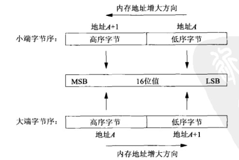
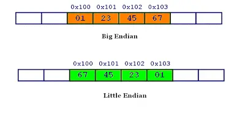

# 如何确定系统的字节序
<!-- TOC -->

- [如何确定系统的字节序](#%E5%A6%82%E4%BD%95%E7%A1%AE%E5%AE%9A%E7%B3%BB%E7%BB%9F%E7%9A%84%E5%AD%97%E8%8A%82%E5%BA%8F)
    - [何为大小端](#%E4%BD%95%E4%B8%BA%E5%A4%A7%E5%B0%8F%E7%AB%AF)
    - [如何确定大小端](#%E5%A6%82%E4%BD%95%E7%A1%AE%E5%AE%9A%E5%A4%A7%E5%B0%8F%E7%AB%AF)
    - [为什么会有字节序](#%E4%B8%BA%E4%BB%80%E4%B9%88%E4%BC%9A%E6%9C%89%E5%AD%97%E8%8A%82%E5%BA%8F)
    - [常见处理器字节序](#%E5%B8%B8%E8%A7%81%E5%A4%84%E7%90%86%E5%99%A8%E5%AD%97%E8%8A%82%E5%BA%8F)

<!-- /TOC -->
## 何为大小端
      
大端序（Big Endian）：高位字节在低地址，低位字节在高地址。      
小端序（Little Endian）：低位字节在低地址，高位字节在高地址。   

 ## 如何确定大小端
可以使用共用体来检测CPU是大端序还是小端序，请看代码：
```c
#include <stdio.h>
int main(){
    union{
        int n;
        char ch;
    } data;
​
    data.n = 0x00000001;  //也可以直接写作 data.n = 1;
    if(data.ch == 1){
        printf("Little-endian\n");
    }else{
        printf("Big-endian\n");
    }
    return 0;
}
```
Output  
`Little-endian`     
共用体的各个成员是共用一段内存的。1是数据的低位，如果1被存储在data的低地址，就是小端模式，这个时候data.ch的值就是1.如果1被存储在data的高字节，就是大端模式，这个时候data.ch的值就是0。
## 为什么会有字节序
计算机电路先处理低位字节，效率比较高，因为计算都是从低位开始的。所以，计算机的内部处理都是小端字节序。

但是，人类还是习惯读写大端字节序。所以，除了计算机的内部处理，其他的场合几乎都是大端字节序，比如网络传输和文件储存。

## 常见处理器字节序
x86、MOS Technology 6502、Z80、VAX、PDP-11等处理器为小端序；
Motorola 6800、Motorola 68000、PowerPC 970、System/370、SPARC（除V9外）等处理器为大端序；
ARM、PowerPC（除PowerPC 970外）、DEC Alpha、SPARC V9、MIPS、PA-RISC及IA64的字节序是可配置的。