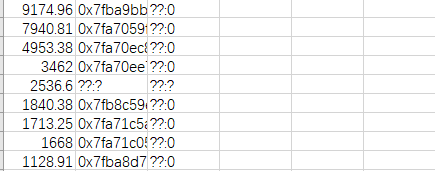
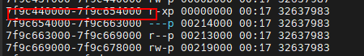
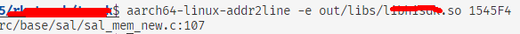

## 内存泄露
 使用mtrace定位内存泄漏问题
### 代码中增加mcheck检测
```c++
    #include <mcheck.h>
    setenv("MALLOC_TRACE", "/tmp/mtrace.log", 1);
    mtrace();
```
### 对mtrace.log文件进行解析：
    
### 运行trace.sh脚本：
```shells
#!/bin/bash

echo "Using mtrace..."                                                                                                                               

mtrace dspttk mtrace.log > $$.txt

sed -i '0,/Address.*Size.*/d' $$.txt

echo "Sorting..."

awk --non-decimal-data '{a[$4]+=$2}END{for(i in a){print a[i]"\t"i}}' $$.txt > out.$$

sort out.$$ -rg -k1 -o $$.txt

echo "Looking up for location..."

awk '{if($2~/0x.*/) {printf $0" "; system("aarch64-himix100-linux-addr2line -p -f -e sc_hicore.nostrip "$2)}else{printf $0" "$2"\n"}}' $$.txt > out.$$

echo "Generating Report..."

echo "Size(KB),Address,Location,Function" > result.csv

awk '{if(NF==3){print $1/1024","$2","$3}else if(NF==4){print $1/1024","$2","$4}else if(NF==5){print $1/1024","$2","$5","$3}}' out.$$ >> result.csv

rm $$.txt
rm out.$$
echo "Job Done!"
```
### 分析表格


### 通过进程id及maps定位库中函数
1. ps命令查看id，在使用`cat /proc/$id/maps`查看对应maps 
  
2. 计算偏移量
3. 通过`aarch64-linux-addr2line -e libname offset`
   
### mtrace执行原理分析
1. 程序运行期间，mtrace 会记录每次内存分配和释放的情况，并将跟踪信息保存在指定的 mtrace 文件中
2. 程序结束后，调用 muntrace 函数，结束内存泄漏检测，并将跟踪信息输出到终端或指定的 mtrace 文件中
3. mtrace 的内存泄漏检测原理是通过对内存的分配和释放进行跟踪，并记录相关信息，从而帮助开发者定位内存泄漏问题

### 注释
 本文未使用umtrace(),停止统计直接通过停掉进程。